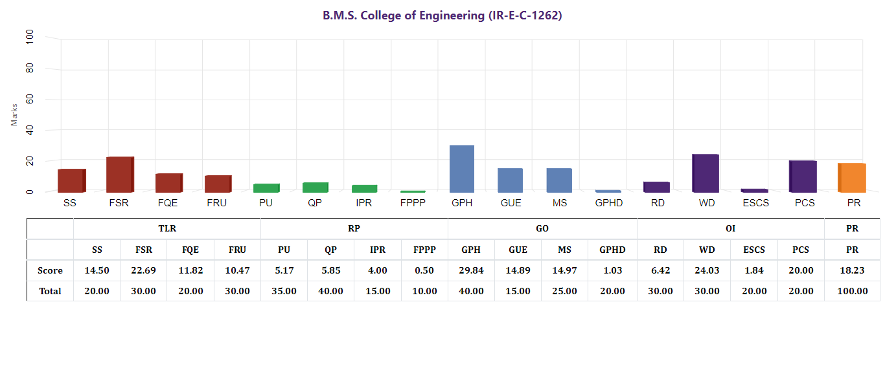
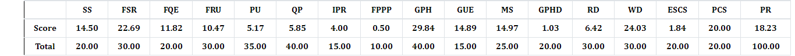

### NIRF_DataExtraction

This repository contains Python scripts for extracting data from images related to the National Institutional Ranking Framework (NIRF). The project utilizes various Python libraries for web scraping, image processing, and data extraction. 

****Data Extracted by the Code:****

| S NO | InstituteID | SS   | FSR  | FQE  | FRU  | PU   | QP   | IPR  | FPPP | GPH  | GUE  | MS   | GPHD | RD   | WD   | ESCS | PCS  | PR   | TLR  | RPC  | GO   | OI   | PERCEPTION | CITY      | STATE     | SCORE | RANK |
|------|-------------|------|------|------|------|------|------|------|------|------|------|------|------|------|------|------|------|------|------|------|------|------|------------|-----------|-----------|-------|------|
| 83   | IR-E-C-1262 | 14.5 | 22.69| 11.82| 10.47| 5.17 | 5.85 | 4    | 0.5  | 29.84| 14.89| 14.97| 1.03 | 6.42 | 24.03| 1.84 | 20   | 18.23| 59.48| 15.52| 60.73| 52.29| 18.23      | Bengaluru | Karnataka | 41.71 | 83   |

#### Python Libraries Used:

1. **Pandas:**
   - A powerful data manipulation and analysis library used for efficient handling, manipulation, and analysis of structured data.

2. **NumPy:**
   - The fundamental package for scientific computing in Python, providing support for large, multi-dimensional arrays and matrices.

3. **os:**
   - The os library facilitates interaction with the operating system, enabling tasks such as file and directory operations, path manipulations, and execution of shell commands.

4. **Requests:**
   - Simplifies HTTP requests, making it easy to interact with APIs and perform web scraping tasks.

5. **Beautiful Soup:**
   - A Python library for parsing HTML and XML files, providing convenient methods for extracting data from web pages.

6. **re (Regular Expression):**
   - The re module is used for handling regular expressions, essential for text-processing tasks.

7. **urllib.request:**
   - A module for opening and reading URLs in Python, simplifying the process of making HTTP requests and handling cookies.

8. **Pillow (Image):**
   - A powerful Python Imaging Library for opening, manipulating, and saving various image file formats.

#### Code Functionalities:

- **Api.py:**
  - Establishes a connection with an Optical Character Recognition API [https://ocr.space/OCRAPI
] to facilitate easy extraction of data from images.

- **Link_extract.py:**
  - Extracts links of images from the HTML code of a website, automatically downloading them to local storage.

- **Cropper.py:**
  - Automatically crops images to contain only the required data, enhancing extraction efficiency.

- **Data_extract.py:**
  - Extracts data using the OCR API, specifically designed to extract specific information from the cropped images, storing the results in a .csv file.

- **Raw_HTML.txt:**
  - Contains a snippet of the HTML div element where the images are located. The link_extract code extracts image links from this file.

